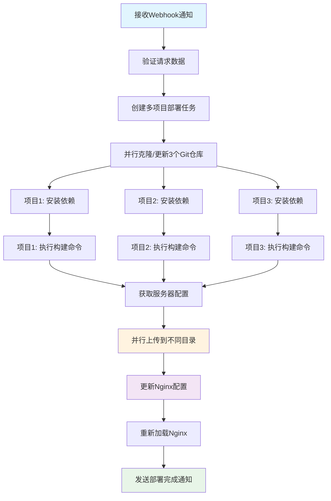

# 多Vue项目自动化部署解决方案修改指南

## 概述

基于现有的单项目自动化部署解决方案，本文档详细说明如何修改系统以支持3个Vue前端项目的并行构建和部署。修改后的系统将能够：

1. 从不同的Git仓库拉取3个Vue项目的源代码
2. 将源代码存储到不同的本地文件夹
3. 执行不同的打包构建命令
4. 上传到客户服务器的不同文件夹
5. 自动配置nginx以提供外部访问

## 修改范围总览

### 需要修改的文件
- `src/config/index.ts` - 配置管理
- `src/services/buildService.ts` - 构建服务 
- `src/services/uploadService.ts` - 上传服务
- `src/services/configService.ts` - 配置服务
- `src/jobs/deploymentJob.ts` - 部署任务处理
- `src/controllers/webhookController.ts` - Webhook控制器
- `src/types/interfaces.ts` - 类型定义
- `.env` - 环境配置

### 新增的服务
- `src/services/gitService.ts` - Git仓库管理服务
- `src/services/nginxService.ts` - Nginx配置管理服务

## 详细修改方案

### 1. 类型定义修改

**文件**: `src/types/interfaces.ts`

```typescript
// 新增项目配置接口
export interface ProjectConfig {
  id: string;
  name: string;
  gitRepository: string;
  gitBranch: string;
  localPath: string;
  buildCommand: string;
  distDirectory: string;
  remotePath: string;
  nginxLocation: string;
  port?: number;
}

// 修改部署请求接口
export interface DeploymentRequest {
  projectIds: string[]; // 修改为数组，支持多项目
  branch: string;
  commitHash?: string;
  triggerBy: string;
  timestamp: string;
  metadata?: {
    buildType: 'production' | 'development';
    priority: 'high' | 'normal' | 'low';
  };
}

// 新增多项目部署状态
export interface MultiProjectDeploymentStatus {
  deploymentId: string;
  overallStatus: 'pending' | 'in_progress' | 'completed' | 'failed' | 'partial_success';
  projects: {
    [projectId: string]: {
      status: 'pending' | 'cloning' | 'building' | 'uploading' | 'configuring' | 'completed' | 'failed';
      progress: number;
      message: string;
      error?: string;
    };
  };
  startTime: string;
  estimatedCompletion?: string;
}
```

### 2. 配置管理修改

**文件**: `src/config/index.ts`

```typescript
import dotenv from 'dotenv';

dotenv.config();

// 项目配置映射
export const PROJECT_CONFIGS: { [key: string]: ProjectConfig } = {
  'admin-portal': {
    id: 'admin-portal',
    name: '管理后台',
    gitRepository: process.env.ADMIN_PORTAL_GIT_REPO || '',
    gitBranch: process.env.ADMIN_PORTAL_GIT_BRANCH || 'main',
    localPath: process.env.ADMIN_PORTAL_LOCAL_PATH || '/app/projects/admin-portal',
    buildCommand: process.env.ADMIN_PORTAL_BUILD_CMD || 'npm run build:prod',
    distDirectory: 'dist',
    remotePath: process.env.ADMIN_PORTAL_REMOTE_PATH || '/var/www/admin',
    nginxLocation: '/admin',
    port: 8080
  },
  'user-portal': {
    id: 'user-portal',
    name: '用户门户',
    gitRepository: process.env.USER_PORTAL_GIT_REPO || '',
    gitBranch: process.env.USER_PORTAL_GIT_BRANCH || 'main',
    localPath: process.env.USER_PORTAL_LOCAL_PATH || '/app/projects/user-portal',
    buildCommand: process.env.USER_PORTAL_BUILD_CMD || 'npm run build',
    distDirectory: 'dist',
    remotePath: process.env.USER_PORTAL_REMOTE_PATH || '/var/www/user',
    nginxLocation: '/user',
    port: 8081
  },
  'mobile-app': {
    id: 'mobile-app',
    name: '移动端应用',
    gitRepository: process.env.MOBILE_APP_GIT_REPO || '',
    gitBranch: process.env.MOBILE_APP_GIT_BRANCH || 'main',
    localPath: process.env.MOBILE_APP_LOCAL_PATH || '/app/projects/mobile-app',
    buildCommand: process.env.MOBILE_APP_BUILD_CMD || 'pnpm build:mobile',
    distDirectory: 'dist',
    remotePath: process.env.MOBILE_APP_REMOTE_PATH || '/var/www/mobile',
    nginxLocation: '/mobile',
    port: 8082
  }
};

export const config = {
  // 原有配置保持不变
  PORT: process.env.PORT || 3001,
  LOG_LEVEL: process.env.LOG_LEVEL || 'info',
  
  // 新增配置
  GIT_SSH_KEY_PATH: process.env.GIT_SSH_KEY_PATH || '/app/keys/id_rsa',
  NGINX_CONFIG_PATH: process.env.NGINX_CONFIG_PATH || '/etc/nginx/sites-available/frontend',
  NGINX_RELOAD_CMD: process.env.NGINX_RELOAD_CMD || 'sudo systemctl reload nginx',
  CONCURRENT_BUILDS: parseInt(process.env.CONCURRENT_BUILDS || '2'),
  
  // Redis配置
  REDIS_HOST: process.env.REDIS_HOST || 'localhost',
  REDIS_PORT: parseInt(process.env.REDIS_PORT || '6379'),
  
  // 后端服务配置
  BACKEND_SERVICE_URL: process.env.BACKEND_SERVICE_URL || 'http://localhost:3000',
  BACKEND_API_TOKEN: process.env.BACKEND_API_TOKEN || ''
};
```

### 3. Git服务新增

**文件**: `src/services/gitService.ts` (新建)

```typescript
import { exec } from 'child_process';
import fs from 'fs-extra';
import path from 'path';
import { promisify } from 'util';
import { config, PROJECT_CONFIGS } from '../config';
import logger from '../utils/logger';
import { ProjectConfig } from '../types/interfaces';

const execAsync = promisify(exec);

export class GitService {
  async cloneOrUpdateProject(
    deploymentId: string, 
    projectId: string
  ): Promise<string> {
    const projectConfig = PROJECT_CONFIGS[projectId];
    if (!projectConfig) {
      throw new Error(`未找到项目配置: ${projectId}`);
    }

    try {
      logger.info(`开始获取项目源代码 [${deploymentId}] [${projectId}]`, {
        repository: projectConfig.gitRepository,
        branch: projectConfig.gitBranch,
        localPath: projectConfig.localPath
      });

      // 确保父目录存在
      await fs.ensureDir(path.dirname(projectConfig.localPath));

      // 检查本地路径是否已存在
      if (await fs.pathExists(projectConfig.localPath)) {
        // 如果存在，拉取最新代码
        await this.updateExistingProject(deploymentId, projectConfig);
      } else {
        // 如果不存在，克隆项目
        await this.cloneNewProject(deploymentId, projectConfig);
      }

      // 切换到指定分支
      await this.checkoutBranch(deploymentId, projectConfig);

      logger.info(`项目源代码获取完成 [${deploymentId}] [${projectId}]`, {
        localPath: projectConfig.localPath
      });

      return projectConfig.localPath;

    } catch (error) {
      logger.error(`获取项目源代码失败 [${deploymentId}] [${projectId}]`, error);
      throw new Error(`Git操作失败: ${error.message}`);
    }
  }

  private async cloneNewProject(
    deploymentId: string, 
    projectConfig: ProjectConfig
  ): Promise<void> {
    const cloneCmd = `git clone ${projectConfig.gitRepository} ${projectConfig.localPath}`;
    
    await execAsync(cloneCmd, {
      env: {
        ...process.env,
        GIT_SSH_COMMAND: `ssh -i ${config.GIT_SSH_KEY_PATH} -o StrictHostKeyChecking=no`
      },
      timeout: 300000 // 5分钟超时
    });

    logger.info(`项目克隆完成 [${deploymentId}]`, {
      project: projectConfig.id,
      localPath: projectConfig.localPath
    });
  }

  private async updateExistingProject(
    deploymentId: string, 
    projectConfig: ProjectConfig
  ): Promise<void> {
    const gitCommands = [
      'git fetch origin',
      'git reset --hard HEAD',
      'git clean -fd',
      `git pull origin ${projectConfig.gitBranch}`
    ];

    for (const cmd of gitCommands) {
      await execAsync(cmd, {
        cwd: projectConfig.localPath,
        env: {
          ...process.env,
          GIT_SSH_COMMAND: `ssh -i ${config.GIT_SSH_KEY_PATH} -o StrictHostKeyChecking=no`
        },
        timeout: 60000
      });
    }

    logger.info(`项目更新完成 [${deploymentId}]`, {
      project: projectConfig.id,
      localPath: projectConfig.localPath
    });
  }

  private async checkoutBranch(
    deploymentId: string, 
    projectConfig: ProjectConfig
  ): Promise<void> {
    const checkoutCmd = `git checkout ${projectConfig.gitBranch}`;
    
    await execAsync(checkoutCmd, {
      cwd: projectConfig.localPath,
      timeout: 30000
    });

    // 获取当前commit信息
    const { stdout: commitHash } = await execAsync('git rev-parse HEAD', {
      cwd: projectConfig.localPath
    });

    logger.info(`分支切换完成 [${deploymentId}]`, {
      project: projectConfig.id,
      branch: projectConfig.gitBranch,
      commitHash: commitHash.trim()
    });
  }

  async getProjectInfo(projectId: string): Promise<{
    lastCommit: string;
    author: string;
    message: string;
    timestamp: string;
  }> {
    const projectConfig = PROJECT_CONFIGS[projectId];
    if (!projectConfig || !await fs.pathExists(projectConfig.localPath)) {
      throw new Error(`项目不存在: ${projectId}`);
    }

    try {
      const { stdout } = await execAsync(
        'git log -1 --pretty=format:"%H|%an|%s|%ci"',
        { cwd: projectConfig.localPath }
      );

      const [hash, author, message, timestamp] = stdout.trim().split('|');

      return {
        lastCommit: hash,
        author,
        message,
        timestamp
      };
    } catch (error) {
      logger.error(`获取项目信息失败 [${projectId}]`, error);
      throw new Error(`Git信息获取失败: ${error.message}`);
    }
  }
}
```

### 4. 构建服务修改

**文件**: `src/services/buildService.ts`

```typescript
import { exec } from "child_process";
import fs from "fs-extra";
import path from "path";
import { promisify } from "util";
import { PROJECT_CONFIGS } from "../config";
import logger from "../utils/logger";
import { ProjectConfig } from "../types/interfaces";

const execAsync = promisify(exec);

export class BuildService {
  
  async buildProject(
    deploymentId: string, 
    projectId: string
  ): Promise<string> {
    const projectConfig = PROJECT_CONFIGS[projectId];
    if (!projectConfig) {
      throw new Error(`未找到项目配置: ${projectId}`);
    }

    try {
      logger.info(`开始构建项目 [${deploymentId}] [${projectId}]`, {
        projectPath: projectConfig.localPath,
        buildCommand: projectConfig.buildCommand,
      });

      // 检查项目目录是否存在
      if (!(await fs.pathExists(projectConfig.localPath))) {
        throw new Error(`项目目录不存在: ${projectConfig.localPath}`);
      }

      // 检查package.json是否存在
      const packageJsonPath = path.join(projectConfig.localPath, "package.json");
      if (!(await fs.pathExists(packageJsonPath))) {
        throw new Error(`package.json不存在: ${packageJsonPath}`);
      }

      // 清理之前的构建结果
      const distPath = path.join(projectConfig.localPath, projectConfig.distDirectory);
      await this.cleanDistDirectory(deploymentId, projectId, distPath);

      // 安装依赖（如果需要）
      await this.installDependencies(deploymentId, projectConfig);

      // 执行构建命令
      const startTime = Date.now();
      const { stdout, stderr } = await execAsync(projectConfig.buildCommand, {
        cwd: projectConfig.localPath,
        env: {
          ...process.env,
          NODE_OPTIONS: "--max-old-space-size=8192",
        },
        timeout: 600000, // 10分钟超时
      });

      const buildTime = Date.now() - startTime;

      if (stderr) {
        logger.warn(`构建警告 [${deploymentId}] [${projectId}]`, { stderr });
      }

      logger.info(`构建输出 [${deploymentId}] [${projectId}]`, { stdout });

      // 验证构建结果
      if (!(await fs.pathExists(distPath))) {
        throw new Error("构建失败：dist目录未生成");
      }

      // 检查dist目录是否有内容
      const distContents = await fs.readdir(distPath);
      if (distContents.length === 0) {
        throw new Error("构建失败：dist目录为空");
      }

      logger.info(`项目构建完成 [${deploymentId}] [${projectId}]`, {
        distPath,
        buildTime: `${buildTime}ms`,
        fileCount: distContents.length,
      });

      return distPath;
    } catch (error) {
      logger.error(`项目构建失败 [${deploymentId}] [${projectId}]`, error);
      throw new Error(`构建失败: ${error.message}`);
    }
  }

  async buildMultipleProjects(
    deploymentId: string, 
    projectIds: string[]
  ): Promise<{ [projectId: string]: string }> {
    const results: { [projectId: string]: string } = {};
    const errors: { [projectId: string]: string } = {};

    // 并行构建（根据配置限制并发数）
    const chunks = this.chunkArray(projectIds, 2); // 最多2个并发
    
    for (const chunk of chunks) {
      const promises = chunk.map(async (projectId) => {
        try {
          const distPath = await this.buildProject(deploymentId, projectId);
          results[projectId] = distPath;
        } catch (error) {
          errors[projectId] = error.message;
          logger.error(`项目构建失败 [${deploymentId}] [${projectId}]`, error);
        }
      });

      await Promise.all(promises);
    }

    // 检查是否有构建失败的项目
    if (Object.keys(errors).length > 0) {
      const errorMsg = Object.entries(errors)
        .map(([projectId, error]) => `${projectId}: ${error}`)
        .join('; ');
      throw new Error(`部分项目构建失败: ${errorMsg}`);
    }

    return results;
  }

  private async installDependencies(
    deploymentId: string, 
    projectConfig: ProjectConfig
  ): Promise<void> {
    try {
      // 检查是否有node_modules目录和package-lock.json
      const nodeModulesPath = path.join(projectConfig.localPath, 'node_modules');
      const packageLockPath = path.join(projectConfig.localPath, 'package-lock.json');
      const pnpmLockPath = path.join(projectConfig.localPath, 'pnpm-lock.yaml');

      let installCmd = 'npm ci';
      
      if (await fs.pathExists(pnpmLockPath)) {
        installCmd = 'pnpm install --frozen-lockfile';
      } else if (!await fs.pathExists(packageLockPath)) {
        installCmd = 'npm install';
      }

      // 只有当node_modules不存在或者lock文件更新时才重新安装
      const shouldInstall = !(await fs.pathExists(nodeModulesPath)) || 
                           await this.isLockFileNewer(projectConfig.localPath);

      if (shouldInstall) {
        logger.info(`安装依赖 [${deploymentId}] [${projectConfig.id}]`, { installCmd });
        
        await execAsync(installCmd, {
          cwd: projectConfig.localPath,
          timeout: 300000, // 5分钟超时
        });

        logger.info(`依赖安装完成 [${deploymentId}] [${projectConfig.id}]`);
      } else {
        logger.info(`跳过依赖安装 [${deploymentId}] [${projectConfig.id}]`);
      }
    } catch (error) {
      logger.error(`依赖安装失败 [${deploymentId}] [${projectConfig.id}]`, error);
      throw new Error(`依赖安装失败: ${error.message}`);
    }
  }

  private async isLockFileNewer(projectPath: string): Promise<boolean> {
    try {
      const nodeModulesPath = path.join(projectPath, 'node_modules');
      const lockFilePaths = [
        path.join(projectPath, 'package-lock.json'),
        path.join(projectPath, 'pnpm-lock.yaml')
      ];

      if (!(await fs.pathExists(nodeModulesPath))) {
        return true;
      }

      const nodeModulesStat = await fs.stat(nodeModulesPath);

      for (const lockFile of lockFilePaths) {
        if (await fs.pathExists(lockFile)) {
          const lockFileStat = await fs.stat(lockFile);
          if (lockFileStat.mtime > nodeModulesStat.mtime) {
            return true;
          }
        }
      }

      return false;
    } catch (error) {
      return true; // 出错时选择重新安装
    }
  }

  private chunkArray<T>(array: T[], size: number): T[][] {
    const chunks: T[][] = [];
    for (let i = 0; i < array.length; i += size) {
      chunks.push(array.slice(i, i + size));
    }
    return chunks;
  }

  async cleanDistDirectory(
    deploymentId: string, 
    projectId: string, 
    distPath: string
  ): Promise<void> {
    try {
      if (await fs.pathExists(distPath)) {
        await fs.remove(distPath);
        logger.info(`清理旧的构建文件 [${deploymentId}] [${projectId}]`, {
          distPath,
        });
      }
    } catch (error) {
      logger.error(`清理构建文件失败 [${deploymentId}] [${projectId}]`, error);
      throw error;
    }
  }

  async cleanupBuild(deploymentId: string, projectIds: string[]): Promise<void> {
    // 保留构建结果，跳过清理
    logger.info(`保留构建文件，跳过清理 [${deploymentId}]`, { projectIds });
  }

  async cleanupOnFailure(deploymentId: string, projectIds: string[]): Promise<void> {
    // 仅在失败时清理所有项目的构建文件
    const cleanupPromises = projectIds.map(async (projectId) => {
      const projectConfig = PROJECT_CONFIGS[projectId];
      if (projectConfig) {
        const distPath = path.join(projectConfig.localPath, projectConfig.distDirectory);
        try {
          if (await fs.pathExists(distPath)) {
            await fs.remove(distPath);
            logger.info(`部署失败，清理构建文件 [${deploymentId}] [${projectId}]`, {
              distPath,
            });
          }
        } catch (error) {
          logger.error(`清理构建文件失败 [${deploymentId}] [${projectId}]`, error);
        }
      }
    });

    await Promise.allSettled(cleanupPromises);
  }
}
```

### 5. Nginx服务新增

**文件**: `src/services/nginxService.ts` (新建)

```typescript
import { exec } from 'child_process';
import fs from 'fs-extra';
import { promisify } from 'util';
import { config, PROJECT_CONFIGS } from '../config';
import logger from '../utils/logger';
import { ProjectConfig } from '../types/interfaces';

const execAsync = promisify(exec);

export class NginxService {
  
  async updateNginxConfig(
    deploymentId: string,
    projectIds: string[],
    serverHost: string
  ): Promise<void> {
    try {
      logger.info(`开始更新Nginx配置 [${deploymentId}]`, {
        projectIds,
        serverHost,
        configPath: config.NGINX_CONFIG_PATH
      });

      // 生成新的nginx配置
      const nginxConfig = this.generateNginxConfig(projectIds, serverHost);
      
      // 备份现有配置
      await this.backupNginxConfig(deploymentId);
      
      // 写入新配置
      await fs.writeFile(config.NGINX_CONFIG_PATH, nginxConfig, 'utf8');
      
      // 验证配置
      await this.validateNginxConfig(deploymentId);
      
      // 重新加载nginx
      await this.reloadNginx(deploymentId);
      
      logger.info(`Nginx配置更新完成 [${deploymentId}]`);
      
    } catch (error) {
      logger.error(`Nginx配置更新失败 [${deploymentId}]`, error);
      
      // 尝试恢复备份配置
      await this.restoreBackupConfig(deploymentId);
      
      throw new Error(`Nginx配置失败: ${error.message}`);
    }
  }

  private generateNginxConfig(projectIds: string[], serverHost: string): string {
    const locations = projectIds.map(projectId => {
      const config = PROJECT_CONFIGS[projectId];
      if (!config) return '';

      return `
    # ${config.name}
    location ${config.nginxLocation} {
        alias ${config.remotePath}/;
        index index.html;
        try_files $uri $uri/ ${config.nginxLocation}/index.html;
        
        # 设置缓存策略
        location ~* \\.(js|css|png|jpg|jpeg|gif|ico|svg|woff|woff2|ttf|eot)$ {
            expires 1y;
            add_header Cache-Control "public, immutable";
        }
        
        # 安全头设置
        add_header X-Frame-Options "SAMEORIGIN" always;
        add_header X-Content-Type-Options "nosniff" always;
        add_header Referrer-Policy "no-referrer-when-downgrade" always;
        add_header Content-Security-Policy "default-src 'self' http: https: data: blob: 'unsafe-inline'" always;
    }`;
    }).join('\n');

    return `# 前端项目Nginx配置
# 自动生成时间: ${new Date().toISOString()}
# 部署的项目: ${projectIds.join(', ')}

server {
    listen 80;
    server_name ${serverHost};
    
    # 日志配置
    access_log /var/log/nginx/frontend_access.log;
    error_log /var/log/nginx/frontend_error.log;
    
    # 全局安全设置
    server_tokens off;
    
    # Gzip压缩
    gzip on;
    gzip_vary on;
    gzip_min_length 1024;
    gzip_proxied expired no-cache no-store private must-revalidate auth;
    gzip_types text/plain text/css text/xml text/javascript application/javascript application/xml+rss application/json;
    
    # 根路径重定向到主应用
    location = / {
        return 301 ${PROJECT_CONFIGS[projectIds[0]]?.nginxLocation || '/admin'};
    }
    
    # 健康检查端点
    location /health {
        access_log off;
        return 200 "healthy\\n";
        add_header Content-Type text/plain;
    }
${locations}
    
    # 404处理
    error_page 404 /404.html;
    location = /404.html {
        root /usr/share/nginx/html;
    }
    
    # 50x错误处理
    error_page 500 502 503 504 /50x.html;
    location = /50x.html {
        root /usr/share/nginx/html;
    }
}

# HTTPS重定向 (可选)
# server {
#     listen 443 ssl http2;
#     server_name ${serverHost};
#     
#     ssl_certificate /path/to/certificate.crt;
#     ssl_certificate_key /path/to/private.key;
#     
#     # SSL配置
#     ssl_protocols TLSv1.2 TLSv1.3;
#     ssl_ciphers ECDHE-RSA-AES256-GCM-SHA512:DHE-RSA-AES256-GCM-SHA512:ECDHE-RSA-AES256-GCM-SHA384;
#     
#     # 包含上面的location块
# }
`;
  }

  private async backupNginxConfig(deploymentId: string): Promise<void> {
    try {
      if (await fs.pathExists(config.NGINX_CONFIG_PATH)) {
        const backupPath = `${config.NGINX_CONFIG_PATH}.backup.${Date.now()}`;
        await fs.copy(config.NGINX_CONFIG_PATH, backupPath);
        logger.info(`Nginx配置已备份 [${deploymentId}]`, { backupPath });
      }
    } catch (error) {
      logger.warn(`Nginx配置备份失败 [${deploymentId}]`, error);
    }
  }

  private async validateNginxConfig(deploymentId: string): Promise<void> {
    try {
      await execAsync('nginx -t', { timeout: 30000 });
      logger.info(`Nginx配置验证通过 [${deploymentId}]`);
    } catch (error) {
      logger.error(`Nginx配置验证失败 [${deploymentId}]`, error);
      throw new Error(`Nginx配置验证失败: ${error.message}`);
    }
  }

  private async reloadNginx(deploymentId: string): Promise<void> {
    try {
      await execAsync(config.NGINX_RELOAD_CMD, { timeout: 30000 });
      logger.info(`Nginx重新加载完成 [${deploymentId}]`);
    } catch (error) {
      logger.error(`Nginx重新加载失败 [${deploymentId}]`, error);
      throw new Error(`Nginx重新加载失败: ${error.message}`);
    }
  }

  private async restoreBackupConfig(deploymentId: string): Promise<void> {
    try {
      // 查找最新的备份文件
      const backupPattern = `${config.NGINX_CONFIG_PATH}.backup.*`;
      const { stdout } = await execAsync(`ls -t ${backupPattern} 2>/dev/null | head -1`, {
        shell: '/bin/bash'
      });
      
      const latestBackup = stdout.trim();
      if (latestBackup && await fs.pathExists(latestBackup)) {
        await fs.copy(latestBackup, config.NGINX_CONFIG_PATH);
        await this.reloadNginx(deploymentId);
        logger.info(`Nginx配置已恢复 [${deploymentId}]`, { backupFile: latestBackup });
      }
    } catch (error) {
      logger.error(`Nginx配置恢复失败 [${deploymentId}]`, error);
    }
  }

  async checkNginxStatus(): Promise<boolean> {
    try {
      await execAsync('nginx -t', { timeout: 10000 });
      const { stdout } = await execAsync('systemctl is-active nginx', { timeout: 10000 });
      return stdout.trim() === 'active';
    } catch (error) {
      return false;
    }
  }

  async getActiveProjects(): Promise<string[]> {
    try {
      if (!await fs.pathExists(config.NGINX_CONFIG_PATH)) {
        return [];
      }

      const configContent = await fs.readFile(config.NGINX_CONFIG_PATH, 'utf8');
      const projects = Object.keys(PROJECT_CONFIGS).filter(projectId => {
        const config = PROJECT_CONFIGS[projectId];
        return configContent.includes(`location ${config.nginxLocation}`);
      });

      return projects;
    } catch (error) {
      logger.error('获取活跃项目列表失败', error);
      return [];
    }
  }
}
```

### 6. 上传服务修改

**文件**: `src/services/uploadService.ts`

```typescript
import { NodeSSH } from 'node-ssh';
import path from 'path';
import fs from 'fs-extra';
import logger from '../utils/logger';
import { ServerConfig } from './configService';
import { PROJECT_CONFIGS } from '../config';

export class UploadService {
  async uploadMultipleProjects(
    deploymentId: string,
    projectBuilds: { [projectId: string]: string },
    serverConfig: ServerConfig
  ): Promise<void> {
    const ssh = new NodeSSH();
    
    try {
      logger.info(`连接服务器 [${deploymentId}]`, { 
        host: serverConfig.host,
        username: serverConfig.username,
        projectCount: Object.keys(projectBuilds).length
      });
      
      // 连接SSH
      await ssh.connect({
        host: serverConfig.host,
        port: serverConfig.port || 22,
        username: serverConfig.username,
        password: serverConfig.password,
        readyTimeout: 30000
      });
      
      // 并行上传所有项目
      const uploadPromises = Object.entries(projectBuilds).map(
        async ([projectId, distPath]) => {
          const projectConfig = PROJECT_CONFIGS[projectId];
          if (!projectConfig) {
            throw new Error(`未找到项目配置: ${projectId}`);
          }
          
          await this.uploadSingleProject(
            ssh,
            deploymentId,
            projectId,
            distPath,
            projectConfig.remotePath
          );
        }
      );

      await Promise.all(uploadPromises);
      
      logger.info(`所有项目文件上传完成 [${deploymentId}]`);
      
    } catch (error) {
      logger.error(`文件上传失败 [${deploymentId}]`, error);
      throw new Error(`上传失败: ${error.message}`);
    } finally {
      ssh.dispose();
    }
  }

  private async uploadSingleProject(
    ssh: NodeSSH,
    deploymentId: string,
    projectId: string,
    localDistPath: string,
    remotePath: string
  ): Promise<void> {
    try {
      logger.info(`开始上传项目 [${deploymentId}] [${projectId}]`, {
        from: localDistPath,
        to: remotePath
      });

      // 创建远程目录备份（如果存在）
      await this.createRemoteBackup(ssh, deploymentId, projectId, remotePath);
      
      // 创建部署目录（如果不存在）
      await ssh.execCommand(`mkdir -p ${remotePath}`);
      
      // 清空目标目录
      await ssh.execCommand(`rm -rf ${remotePath}/*`);
      
      // 上传构建文件
      await ssh.putDirectory(localDistPath, remotePath, {
        recursive: true,
        concurrency: 3,
        validate: (itemPath) => {
          // 排除隐藏文件和系统文件
          const basename = path.basename(itemPath);
          return !basename.startsWith('.') && 
                 basename !== 'node_modules' && 
                 basename !== '.git';
        },
        tick: (localPath, remotePath, error) => {
          if (error) {
            logger.error(`文件上传失败 [${deploymentId}] [${projectId}]`, { 
              localPath, 
              error 
            });
          }
        }
      });
      
      // 设置文件权限
      await ssh.execCommand(`chmod -R 755 ${remotePath}`);
      
      // 设置正确的所有者（如果需要）
      await ssh.execCommand(`chown -R www-data:www-data ${remotePath}`);
      
      logger.info(`项目上传完成 [${deploymentId}] [${projectId}]`, {
        remotePath
      });
      
    } catch (error) {
      logger.error(`项目上传失败 [${deploymentId}] [${projectId}]`, error);
      throw error;
    }
  }

  private async createRemoteBackup(
    ssh: NodeSSH,
    deploymentId: string,
    projectId: string,
    remotePath: string
  ): Promise<void> {
    try {
      // 检查远程目录是否存在
      const { code } = await ssh.execCommand(`test -d ${remotePath}`);
      if (code === 0) {
        const timestamp = new Date().toISOString().replace(/[:.]/g, '-');
        const backupDir = `${remotePath}-backup-${timestamp}`;
        
        await ssh.execCommand(`cp -r ${remotePath} ${backupDir}`);
        logger.info(`远程备份已创建 [${deploymentId}] [${projectId}]`, { 
          backupDir 
        });
        
        // 保留最近5个备份
        const backupParentDir = path.dirname(remotePath);
        const projectName = path.basename(remotePath);
        await ssh.execCommand(
          `cd ${backupParentDir} && ls -t | grep "^${projectName}-backup-" | tail -n +6 | xargs -r rm -rf`
        );
      }
    } catch (error) {
      logger.warn(`创建远程备份失败 [${deploymentId}] [${projectId}]`, error);
    }
  }

  // 保持原有的单项目上传方法向后兼容
  async uploadToServer(
    deploymentId: string,
    localPath: string,
    serverConfig: ServerConfig
  ): Promise<void> {
    // 使用第一个项目配置作为默认值
    const firstProjectId = Object.keys(PROJECT_CONFIGS)[0];
    const projectBuilds = { [firstProjectId]: localPath };
    
    await this.uploadMultipleProjects(deploymentId, projectBuilds, serverConfig);
  }
}
```

### 7. 部署任务处理修改

**文件**: `src/jobs/deploymentJob.ts`

```typescript
import Bull from 'bull';
import Redis from 'ioredis';
import { GitService } from '../services/gitService';
import { BuildService } from '../services/buildService';
import { ConfigService } from '../services/configService';
import { UploadService } from '../services/uploadService';
import { NginxService } from '../services/nginxService';
import { NotificationService } from '../services/notificationService';
import logger from '../utils/logger';
import { MultiProjectDeploymentStatus } from '../types/interfaces';

const redis = new Redis({
  host: process.env.REDIS_HOST || 'localhost',
  port: parseInt(process.env.REDIS_PORT || '6379')
});

export const deploymentQueue = new Bull('deployment', {
  redis: {
    host: process.env.REDIS_HOST || 'localhost',
    port: parseInt(process.env.REDIS_PORT || '6379')
  }
});

const gitService = new GitService();
const buildService = new BuildService();
const configService = new ConfigService();
const uploadService = new UploadService();
const nginxService = new NginxService();
const notificationService = new NotificationService();

deploymentQueue.process('build-and-deploy-multi', async (job) => {
  const { deploymentId, projectIds, branch, commitHash } = job.data;
  
  try {
    logger.info(`开始执行多项目部署任务 [${deploymentId}]`, {
      projectIds,
      branch,
      commitHash
    });
    
    // 初始化部署状态
    await initializeDeploymentStatus(deploymentId, projectIds);
    await job.progress(5);
    
    // 步骤1: 克隆/更新所有项目源代码
    logger.info(`步骤1: 获取项目源代码 [${deploymentId}]`);
    await updateProjectStatus(deploymentId, projectIds, 'cloning', '正在获取源代码...');
    
    const clonePromises = projectIds.map(projectId => 
      gitService.cloneOrUpdateProject(deploymentId, projectId)
        .then(() => updateSingleProjectStatus(deploymentId, projectId, 'cloning', '源代码获取完成', 100))
        .catch(error => {
          updateSingleProjectStatus(deploymentId, projectId, 'failed', `源代码获取失败: ${error.message}`, 0);
          throw error;
        })
    );
    
    await Promise.all(clonePromises);
    await job.progress(20);
    
    // 步骤2: 构建所有项目
    logger.info(`步骤2: 构建项目 [${deploymentId}]`);
    await updateProjectStatus(deploymentId, projectIds, 'building', '正在构建项目...');
    
    const projectBuilds = await buildService.buildMultipleProjects(deploymentId, projectIds);
    
    // 更新构建完成的项目状态
    for (const projectId of projectIds) {
      if (projectBuilds[projectId]) {
        await updateSingleProjectStatus(deploymentId, projectId, 'building', '项目构建完成', 100);
      }
    }
    
    await job.progress(50);
    
    // 步骤3: 获取服务器配置
    logger.info(`步骤3: 获取服务器配置 [${deploymentId}]`);
    const serverConfig = await configService.getServerConfig(deploymentId, projectIds[0]); // 使用第一个项目获取配置
    await job.progress(60);
    
    // 步骤4: 上传文件到服务器
    logger.info(`步骤4: 上传文件 [${deploymentId}]`);
    await updateProjectStatus(deploymentId, projectIds, 'uploading', '正在上传文件...');
    
    await uploadService.uploadMultipleProjects(deploymentId, projectBuilds, serverConfig);
    
    // 更新上传完成的项目状态
    for (const projectId of projectIds) {
      await updateSingleProjectStatus(deploymentId, projectId, 'uploading', '文件上传完成', 100);
    }
    
    await job.progress(80);
    
    // 步骤5: 配置Nginx
    logger.info(`步骤5: 配置Nginx [${deploymentId}]`);
    await updateProjectStatus(deploymentId, projectIds, 'configuring', '正在配置Nginx...');
    
    await nginxService.updateNginxConfig(deploymentId, projectIds, serverConfig.host);
    
    // 更新配置完成的项目状态
    for (const projectId of projectIds) {
      await updateSingleProjectStatus(deploymentId, projectId, 'configuring', 'Nginx配置完成', 100);
    }
    
    await job.progress(90);
    
    // 步骤6: 清理构建文件
    await buildService.cleanupBuild(deploymentId, projectIds);
    
    // 步骤7: 完成部署
    await updateProjectStatus(deploymentId, projectIds, 'completed', '部署完成');
    await updateOverallStatus(deploymentId, 'completed', '所有项目部署完成');
    await job.progress(100);
    
    // 步骤8: 发送成功通知
    await notificationService.sendMultiProjectSuccessNotification(deploymentId, {
      projectIds,
      branch,
      commitHash,
      serverHost: serverConfig.host,
      projectBuilds
    });
    
    logger.info(`多项目部署任务完成 [${deploymentId}]`, { projectIds });
    
  } catch (error) {
    logger.error(`多项目部署任务失败 [${deploymentId}]`, error);
    
    // 更新失败状态
    await updateOverallStatus(deploymentId, 'failed', `部署失败: ${error.message}`);
    
    // 清理失败的构建文件
    await buildService.cleanupOnFailure(deploymentId, projectIds);
    
    // 发送失败通知
    await notificationService.sendFailureNotification(deploymentId, error);
    
    throw error;
  }
});

// 保持向后兼容的单项目部署处理
deploymentQueue.process('build-and-deploy', async (job) => {
  const { deploymentId, projectId } = job.data;
  
  // 转换为多项目格式处理
  const multiProjectData = {
    ...job.data,
    projectIds: [projectId]
  };
  
  // 创建新的多项目任务
  await deploymentQueue.add('build-and-deploy-multi', multiProjectData, job.opts);
});

async function initializeDeploymentStatus(
  deploymentId: string,
  projectIds: string[]
): Promise<void> {
  const status: MultiProjectDeploymentStatus = {
    deploymentId,
    overallStatus: 'pending',
    projects: {},
    startTime: new Date().toISOString()
  };
  
  // 初始化每个项目的状态
  for (const projectId of projectIds) {
    status.projects[projectId] = {
      status: 'pending',
      progress: 0,
      message: '等待开始...'
    };
  }
  
  const statusKey = `deployment:${deploymentId}:status`;
  await redis.set(statusKey, JSON.stringify(status), 'EX', 86400); // 24小时过期
}

async function updateProjectStatus(
  deploymentId: string,
  projectIds: string[],
  status: string,
  message: string
): Promise<void> {
  for (const projectId of projectIds) {
    await updateSingleProjectStatus(deploymentId, projectId, status, message, 0);
  }
}

async function updateSingleProjectStatus(
  deploymentId: string,
  projectId: string,
  status: string,
  message: string,
  progress: number = 0
): Promise<void> {
  const statusKey = `deployment:${deploymentId}:status`;
  const statusData = await redis.get(statusKey);
  
  if (statusData) {
    const deploymentStatus: MultiProjectDeploymentStatus = JSON.parse(statusData);
    
    deploymentStatus.projects[projectId] = {
      status: status as any,
      progress,
      message
    };
    
    await redis.set(statusKey, JSON.stringify(deploymentStatus), 'EX', 86400);
  }
}

async function updateOverallStatus(
  deploymentId: string,
  status: string,
  message: string
): Promise<void> {
  const statusKey = `deployment:${deploymentId}:status`;
  const statusData = await redis.get(statusKey);
  
  if (statusData) {
    const deploymentStatus: MultiProjectDeploymentStatus = JSON.parse(statusData);
    
    deploymentStatus.overallStatus = status as any;
    
    // 设置预计完成时间
    if (status === 'completed') {
      deploymentStatus.estimatedCompletion = new Date().toISOString();
    }
    
    await redis.set(statusKey, JSON.stringify(deploymentStatus), 'EX', 86400);
    
    logger.info(`部署状态更新 [${deploymentId}]`, { status, message });
  }
}

// 处理失败任务
deploymentQueue.on('failed', async (job, err) => {
  logger.error(`部署任务失败 [${job.data.deploymentId}]`, err);
  await updateOverallStatus(job.data.deploymentId, 'failed', err.message);
});

// 处理完成任务
deploymentQueue.on('completed', async (job) => {
  logger.info(`部署任务完成 [${job.data.deploymentId}]`);
});
```

### 8. 环境配置更新

**文件**: `.env`

```bash
# 原有配置保持不变
NODE_ENV=production
PORT=3001
LOG_LEVEL=info

# Redis配置
REDIS_HOST=localhost
REDIS_PORT=6379
REDIS_PASSWORD=

# 后端服务配置
BACKEND_SERVICE_URL=http://your-backend-service:3000
BACKEND_API_TOKEN=your-api-token

# 安全配置
WEBHOOK_SECRET=your-webhook-secret
API_RATE_LIMIT=100

# 通知配置
NOTIFICATION_WEBHOOK_URL=http://your-notification-service/webhook
EMAIL_SERVICE_API_KEY=your-email-api-key

# ===== 新增：多项目配置 =====

# Git配置
GIT_SSH_KEY_PATH=/app/keys/id_rsa

# 管理后台项目配置
ADMIN_PORTAL_GIT_REPO=git@github.com:your-org/admin-portal.git
ADMIN_PORTAL_GIT_BRANCH=main
ADMIN_PORTAL_LOCAL_PATH=/app/projects/admin-portal
ADMIN_PORTAL_BUILD_CMD=npm run build:prod
ADMIN_PORTAL_REMOTE_PATH=/var/www/admin

# 用户门户项目配置
USER_PORTAL_GIT_REPO=git@github.com:your-org/user-portal.git
USER_PORTAL_GIT_BRANCH=main
USER_PORTAL_LOCAL_PATH=/app/projects/user-portal
USER_PORTAL_BUILD_CMD=npm run build
USER_PORTAL_REMOTE_PATH=/var/www/user

# 移动端应用项目配置
MOBILE_APP_GIT_REPO=git@github.com:your-org/mobile-app.git
MOBILE_APP_GIT_BRANCH=main
MOBILE_APP_LOCAL_PATH=/app/projects/mobile-app
MOBILE_APP_BUILD_CMD=pnpm build:mobile
MOBILE_APP_REMOTE_PATH=/var/www/mobile

# Nginx配置
NGINX_CONFIG_PATH=/etc/nginx/sites-available/frontend
NGINX_RELOAD_CMD=sudo systemctl reload nginx

# 性能配置
CONCURRENT_BUILDS=2
```

### 9. Webhook控制器修改

**文件**: `src/controllers/webhookController.ts`

需要修改以支持多项目部署：

```typescript
export class WebhookController {
  async handleMultiProjectDeployment(req: Request, res: Response) {
    try {
      // 验证请求数据
      const deploymentData = validateMultiProjectDeploymentRequest(req.body);
      
      // 创建部署任务ID
      const deploymentId = `deploy-${Date.now()}-${Math.random().toString(36).substr(2, 9)}`;
      
      // 添加到多项目部署队列
      await deploymentQueue.add('build-and-deploy-multi', {
        deploymentId,
        ...deploymentData
      }, {
        priority: deploymentData.metadata?.priority === 'high' ? 10 : 5,
        attempts: 3,
        backoff: 'exponential'
      });
      
      logger.info(`多项目部署任务已创建: ${deploymentId}`, { deploymentData });
      
      res.json({
        success: true,
        deploymentId,
        message: '多项目部署任务已创建',
        projectCount: deploymentData.projectIds.length,
        estimatedTime: `${5 + deploymentData.projectIds.length * 3}-${10 + deploymentData.projectIds.length * 5}分钟`
      });
    } catch (error) {
      logger.error('创建多项目部署任务失败', error);
      res.status(400).json({
        success: false,
        message: error.message
      });
    }
  }
}
```

## 部署流程图



## API接口变更

### 新的多项目部署接口

```typescript
POST /api/webhook/deploy-multi
Content-Type: application/json

{
  "projectIds": ["admin-portal", "user-portal", "mobile-app"],
  "branch": "main",
  "commitHash": "abc123",
  "triggerBy": "backend-service",
  "timestamp": "2025-01-07T10:00:00Z",
  "metadata": {
    "buildType": "production",
    "priority": "high"
  }
}
```

### 修改后的状态查询接口

```typescript
GET /api/deployment/{deploymentId}/status

Response:
{
  "deploymentId": "deploy-123456",
  "overallStatus": "in_progress",
  "projects": {
    "admin-portal": {
      "status": "completed",
      "progress": 100,
      "message": "部署完成"
    },
    "user-portal": {
      "status": "uploading", 
      "progress": 80,
      "message": "正在上传文件..."
    },
    "mobile-app": {
      "status": "building",
      "progress": 60, 
      "message": "正在构建项目..."
    }
  },
  "startTime": "2025-01-07T10:00:00Z",
  "estimatedCompletion": "2025-01-07T10:15:00Z"
}
```

## 总结

通过以上修改，系统将能够：

1. **并行处理**: 同时处理3个Vue项目的构建和部署
2. **独立配置**: 每个项目有独立的Git仓库、构建命令和部署路径  
3. **智能依赖管理**: 根据lock文件智能决定是否重新安装依赖
4. **统一Nginx配置**: 自动生成包含所有项目的Nginx配置
5. **详细状态跟踪**: 提供每个项目的独立状态和整体进度
6. **错误恢复**: 支持配置备份和失败回滚
7. **向后兼容**: 保持对原有单项目API的支持

这个解决方案提供了一个可扩展、可维护的多项目自动化部署系统，能够满足复杂的前端项目部署需求。